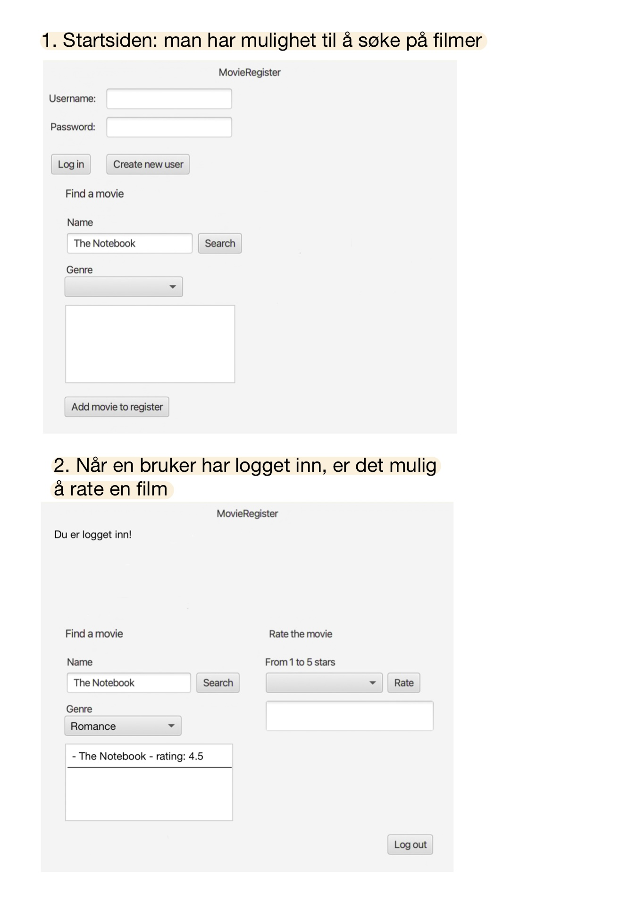
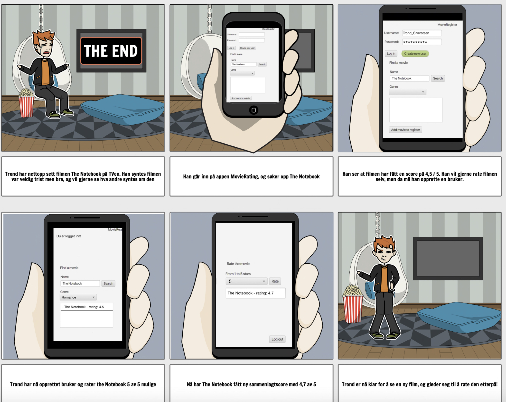

# Movie Rating Project

## The app's functionalities

1. The user must be able to log in or create a new user
    - Create a new user
    - If the user is not registered, they must be given a choice to create a new user.
    - When the user is logged in or logs out, feedback must be given that the action was successful.
2. User must be able to search for movies and see the rating regardless of whether the user is logged in or not.
    - The movie(s) that satisfy the search should appear
    - If you are logged in, it should be possible to rate the movie you click on
    - If the movie is not registered, it must be possible to add the movie with the attributes "title", "genre" and eventually a "rating" at the end. This is saved to a file.
    - If the user has already rated this film, feedback must be given that it is not possible to rate again **MISSING**
3. User should be able to select a genre from a drop-down menu and see a list of movies of that genre.
    - If you are logged in, it should be possible to rate the film you click on
    - If the user has already rated this film, feedback must be given that it is not possible to rate again **MISSING**
4. Rating
    - From a drop-down menu, the user must be able to give a rating to the selected movie from 1 and up to 5.
    - The user should then see an updated rating for the film
    - The rating is saved in two files
        1. User - all the users are stored here with associated movies that they have rated
        2. MovieRegister - all the movies are stored here with genre and what these have been rated.

**Possible extension:**

1. Sorting of the film register
    - Rating, several drop-down menus based on theme, year, actors, etc.
2. Overview of the user's rated films, sorted from highest rated to lowest
3. Expand with physical stars as a rating
4. Expand so that partial searches come up, for example by a matching word or the like.
5. We see that the Handler and Register classes of Movie and User have much of the same setup. For the next release, we will therefore look at the possibility of implementing inheritance on these classes.

**Screenshot to illustrate the app:**

## User stories

Trond has just seen the movie "The Notebook". He thinks the film was good, even if it was very sad. Trond also wants to see what others who have seen the film think of it, and goes into the MovieRating app and searches for "The Notebook". Here he sees that the film has received 4.5/5 stars. Trond also wants to rate the film himself, so he creates a user by entering a username and password. He then rates the film 5 stars. The average rating updates to 4.7 and Trond is satisfied.

**See user history:**

## Implicit file storage

We have adopted implicit file storage in this project. For example, the user presses "Create new user", and then this user is saved to a file, without it saying "save" on the button. Another example is if a user wants to add a movie to the list of all movies. This movie is saved to a file, but the user is not notified that it is being saved. The button just says "Add movie to register". Our last example of implicit storage is where the user can add a rating to a movie. If the user clicks on the "Rate" button, the new average rating of that movie is saved to a file, without the user being notified of this.

**The files are structured in the following format:**\
Text marked in bold is false names in json, but remaining text is data.\
Movie: \
[ { \
&ensp; **"title"** : "title1", \
&ensp; **"genre"** : "genre1", \
&ensp; **"allRatings"** : [ x1, x2 ] \
}, {\
&ensp; **"title"** : "title2", \
&ensp; **"genre"** : "genre2", \
&ensp; **"allRatings"** : [ y1, y2 ] \
} ]

User: \
[ { \
&ensp; **"username"** : "username1", \
&ensp; **"password"** : "password1", \
&ensp; **"ratedMovies"** : [ { \
&ensp; &ensp; **"title"** : "title1", \
&ensp; &ensp; **"genre"** : "genre1", \
&ensp; &ensp; **"rating"** : x1 \
&ensp; }, { \
&ensp; &ensp; **"title"** : "title2", \
&ensp; &ensp; **"genre"** : "genre2", \
&ensp; &ensp; **"rating"** : y1 \
&ensp; } ] \
}, { \
&ensp; **"username"** : "username2", \
&ensp; **"password"** : "password2", \
&ensp; **"ratedMovies"** : [ { \
&ensp; &ensp; **"title"** : "title1", \
&ensp; &ensp; **"genre"** : "genre1", \
&ensp; &ensp; **"rating"** : x2 \
&ensp; } ] \
} ]

## Work habits and code quality

- We sit down together and go through work tasks and create issues for what we are going to do. When we work on the various tasks, we do this in separate branches with the name and number of the issue the task is associated with.

- We use milestones linked to each exercise, i.e. exercise 1, exercise 2 etc.

- We sit together and work in longer working sessions. In that way, we can help each other and we get a lot done and familiarize ourselves properly with the project and work tasks. We then either sit and code in pairs, preferably two by two, but use everyone in the group if questions or problems arise. Where it is not as appropriate to work in pairs, we work independently, but ensure code quality by always making merge requests and one or more others in the group go through them.

- We also comment on the codes along the way so that it is easier to get used to them