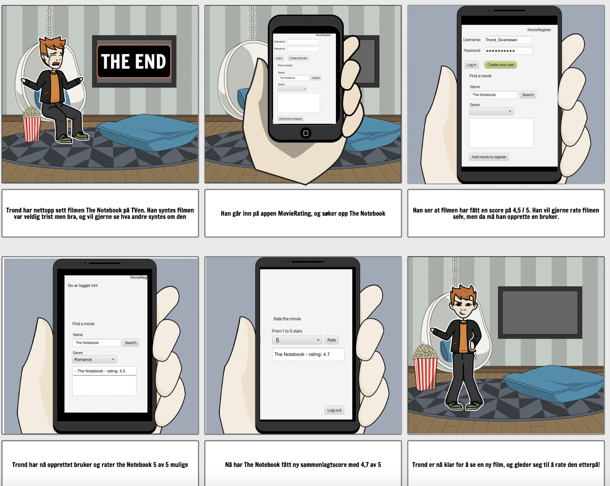

**USER STORIES TO MOVIE RATING APP**

1. *Story 1 - see all ratings*
    - Emma wants to have a overview of the movies she has rated while she has been an user of the Movie Rating App. She then logs in and on the right side there is a list over all the movies she has rated over the time.

2. *Story 2 - look up the rating of a movie*
    - Christian has just seen the new movie "Hello Darling", and he thought it was all right. He then wants to check what other people's thouth of the movies was. He then opens the app Movie Rating, goes to the search function and types in the movie name. When he clicks on the button he sees that the average rate for that movie is 3.5 out of 5. 

3. *Story 3 - register an user and then add a rating*
    - Per creates an user on the Movie Rating App by typing in a valid usernme and password. This proviedes him access to rate a movie. After creating an user, and is successfully logged in, he can then search up the movie "The Notebook", which is in the register. The average rating is now 4.5 out of 5. He then rates the movie 5/5, and he can then see that the average rating is updated to 4.7.

**See user story 3 illustrated:**

