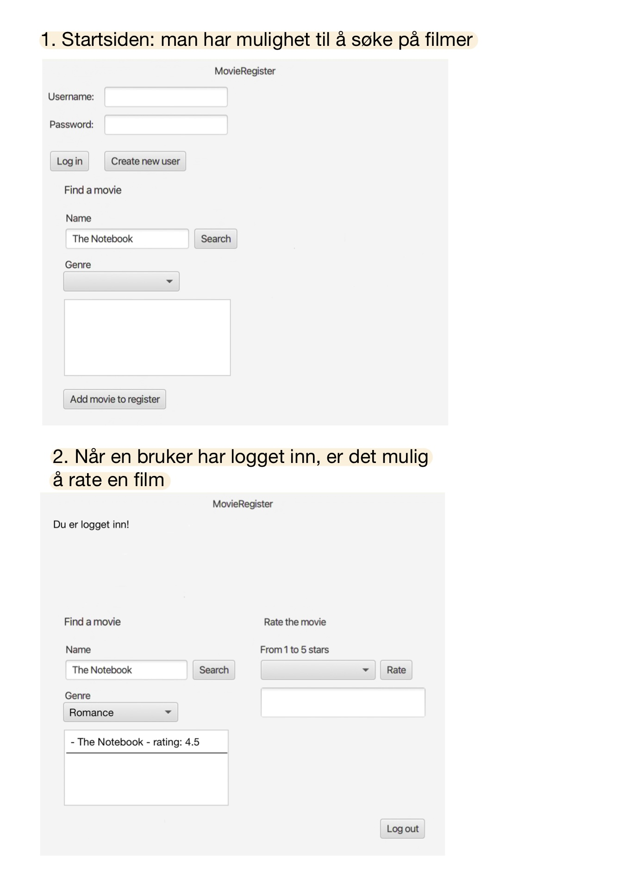

# Movie Rating Project

## Appens funksjonaliteter

1. Bruker skal kunne logge seg inn eller lage ny bruker
    - Lage ny bruker
    - Dersom bruker ikke er registrert skal den få et valg om å opprette en ny bruker. (ikke implementert)
    - Når bruker er logget inn, eller har opprettet en bruker skal det gis feedback på at bruker nå er logget inn. 
2. En skal kunne søke på filmer og se ratingen uansett om man er logget inn eller ikke.
    - Filmen(e) som tilfredstiller søket skal dukke opp (ikke implementert)
    - Dersom man er logget inn skal det være mulig å rate filmen man trykker på
    - Dersom man ikke er logget inn gis det feedback om det.
    - Dersom filmen ikke er registrert skal det være mulig å legge til filmen med attributtene "title", "genre" og til slutt en "rating". Dette lagres til fil.
    - Dersom brukeren allerede har ratet denne filmen, skal det gis feedback på at det ikke er mulig å rate igjen
3. En skal kunne velge en sjanger fra en nedtrekksmeny og se en liste med filmer av den sjangeren.
    - Dersom man er logget inn skal det være mulig å rate filmen man trykker på
    - Dersom man ikke er logget inn gis det beskjed om det.
    - Dersom brukeren allerede har ratet denne filmen, skal det gis feedback på at det ikke er mulig å rate igjen
4. Rating
    - Fra en nedtrekksmeny skal brukeren kunne gi rating til valgte film fra 1-5.
    - Deretter skal bruker få opp oppdatert rating på filmen
    - Ratingen lagres i to filer
        1. User - her samles alle filmene en bruker har ratet
        2. MovieRegister - her oppdateres gjennomsnittsratingen etter hvert som filmer blir ratet.

**Mulige utvidelse:**

1. Sortering av filmregisteret
    - Rating, flere nedtrekksmenyer basert på tema, år, skuespillere osv.
2. Oversikt over brukerens ratede filmer, sortert fra høyest rate til lavest
3. Utvide med fysiske stjerner som rating
4. Utvide slik at delvis søk kommer opp, for eksempel ved et matchende ord el.
5. Vi ser at Handler og Register klassene til Movie og User har mye av det samme oppsettet. Til neste release skal derfor vi se på muligheten for å implementere arv på disse klassene.

**Skjermbilde for å illustrere appen:**

## Brukerhistorier

Trond har nettopp sett filmen "The Notebook". Han synes filmen var bra, selv om den var veldig trist. Trond ønsker også å se hva andre som har sett filmen synes om den, og går inn i MovieRating- appen og søker opp "The Notebook". Her ser han at filmen har fått 4.5/5 stjerner. Trond ønsker også å rate filmen selv, så han oppretter en bruker ved å skrive inn et brukernavn og passord. Deretter rater han filmen 5 stjerner. Gjennomsnittsratingen oppdaterer seg til 4.7 og Trond er fornøyd.

**Se brukerhistorien:**

## Implisitt fillagring
Vi har tatt i bruk implisitt fillagring i dette prosjektet. For eksempel trykker bruker på "Create new user", og da lagres denne useren til fil, uten at det står "lagre" på knappen. Et annet eksempel er dersom en bruker ønsker å legge til en movie i listen over alle movies. Denne movien lagres til fil men bruker får ikke beskjed om at den lagres. På knappen står det bare "Add movie to register". Det siste eksempelet vårt på implisitt lagring er der bruker kan legge til rating på en movie. Dersom bruker klikker på knappen "Rate" lagres ny gjennomsnittlig rating av den movien til fil, uten at bruker får beskjed om dette. 

## Arbeidsvaner og kodekvalitet

- Vi setter oss ned sammen og går gjennom arbeidsoppgaver og lager issues for det vi skal gjøre. Når vi jobber med de ulike oppgavene gjør vi dette i egne branches med navnet og nummeret på issuen arbeidsoppgaven er tilknyttet.

- Vi bruker milestones knyttet til hver øving, altså øving1, øving2 osv.

- Vi sitter sammen og jobber i lengre arbeidsøkter. På den måten kan vi hjelpe hverandre og vi får gjort mye og satt oss ordentlig inn i prosjektet og arbeidsoppgavene. Vi sitter da enten og koder i par, gjerne to og to, men bruker alle på gruppen dersom det dukker opp spørsmål eller prolemer. Der det ikke er like hensiktsmessig å jobbe i par jobber vi selvstendig, men sikrer kodekvaliteten ved at vi alltid lager merge requests og en eller flere andre på gruppen går igjennom.

- Vi kommenterer også kodene underveis slik at det er enklere å sette seg inn i andres kode.

- Vi skriver tester for de ulike modulene slik at vi tester alle lagene i prosjektet.

- Testdekningsgrad sjekkes ved hjelp av Jacocco. Denne benyttes veiledende, og må vurderes etter skjønn. Det anses ikke som nødvendig å ha 100% testdekningsgrad.

- Kodekvalitet sjekkes ved hjelp av SpotBugs og CheckStyle.

- Denne måten å jobbe på fungerer veldig bra for vår gruppe og vi har satt faste tidspunkter i uken for arbeidsøktene våre. Det gir god arbeidsflyt og alle på gruppen bidrar.

## PlantUML

### Klassediagram over applikasjonen

Viser sammenheng mellom klassene med felt, metoder og assosiasjoner.

### Komponentdiagram over arkitektur

Viser sammenheng mellom de ulike arkitekturene i applikasjonen.

