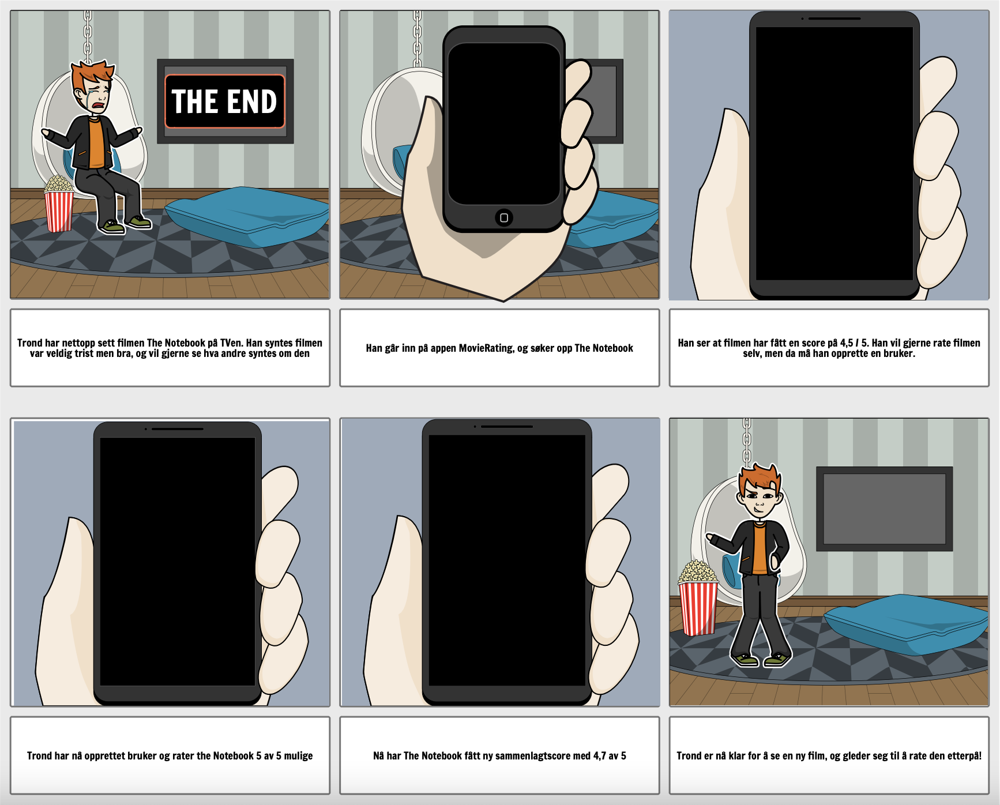

**Brukerhistorier**

**Brukerhistorie 1**
Trond har nettopp sett filmen "The Notebook". Han synes filmen var bra, selv om den var veldig trist. Trond ønsker også å se hva andre som har sett filmen synes om den, og går inn i MovieRating- appen og søker opp "The Notebook". Her ser han at filmen har fått 4.5/5 stjerner. Trond ønsker også å rate filmen selv, så han oppretter en bruker ved å skrive inn et brukernavn og passord. Deretter rater han filmen 5 stjerner. Gjennomsnittsratingen oppdaterer seg til 4.7 og Trond er fornøyd. 

**Se brukerhistorien**
