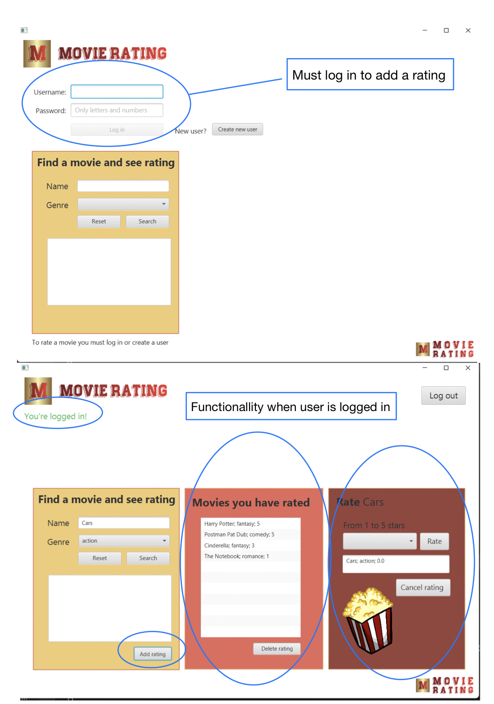

# Movie Rating Project

## The app's functionalities

1. The user must be able to log in or create a new user
    - Create a new user
    - If the user is not registered, they must be given a choice to create a new user.
    - When the user is logged in or logs out, feedback must be given that the action was successful.
2. User must be able to search for movies and see the rating regardless of whether the user is logged in or not.
    - The movie(s) that satisfy the search should appear
    - If you are logged in, it should be possible to rate the movie you click on
    - If the movie is not registered, it must be possible to add the movie with the attributes "title", "genre" and eventually a "rating" at the end. This is saved to a file.
    - If the user has already rated this film, feedback is given that it is not possible to rate again
3. User should be able to select a genre from a drop-down menu and see a list of movies of that genre.
    - If you are logged in, it should be possible to rate the film you click on
    - If the user has already rated this film, feedback is given that it is not possible to rate again
4. Rating
    - From a drop-down menu, the user is be able to give a rating to the selected movie from 1 and up to 5.
    - If a user already has rated a movie, it is possible to delete this rating. If a user wish to alter their rating, the rating must first be deleted, then re-added.
    - The user should then see an updated rating for the film
    - The rating is saved in two files
        1. User - all the users are stored here with associated movies that they have rated. Even if a user hasn´t rated any movies, the user will still exist in the file.
        2. MovieRegister - all the movies are stored here with genre and what these have been rated. Even if the movie doesn´t have any ratings, it will still exist in the file.
5. Overview of a users rated movies
    - Users should be able to see an overview of their own rated movies.
    - This list will be modified as the user adds new ratings or deletes ratings.

**Screenshot to illustrate the app:**

## Implicit file storage and json format

We have adopted implicit file storage in this project. For example, the user presses "Create new user", and then this user is saved to a file, without it saying "save" on the button. Another example is if a user wants to add a movie to the list of all movies. This movie is saved to a file, but the user is not notified that it is being saved. The button just says "Add movie to register". Our last example of implicit storage is where the user can add a rating to a movie. If the user clicks on the "Rate" button, the new average rating of that movie is saved to a file, without the user being notified of this.

**The files are structured in the following format:**\
Text marked in bold is false names in json, but remaining text is data.\
Movie: \
The file containing movies, are set together of one list containing many movie objects. Each object contain of a title, a genre and an integer list of all ratings.
[ { \
&ensp; **"title"** : "title1", \
&ensp; **"genre"** : "genre1", \
&ensp; **"allRatings"** : [ x1, x2 ] \
}, {\
&ensp; **"title"** : "title2", \
&ensp; **"genre"** : "genre2", \
&ensp; **"allRatings"** : [ y1, y2 ] \
} ]

User: \
The file containing users contains a list of user objects, where each user object contains a username, a password and a list of rated movies. Each rated movie in the user object contains a title, a genre and the users rating of the movie.
[ { \
&ensp; **"username"** : "username1", \
&ensp; **"password"** : "password1", \
&ensp; **"ratedMovies"** : [ { \
&ensp; &ensp; **"title"** : "title1", \
&ensp; &ensp; **"genre"** : "genre1", \
&ensp; &ensp; **"rating"** : x1 \
&ensp; }, { \
&ensp; &ensp; **"title"** : "title2", \
&ensp; &ensp; **"genre"** : "genre2", \
&ensp; &ensp; **"rating"** : y1 \
&ensp; } ] \
}, { \
&ensp; **"username"** : "username2", \
&ensp; **"password"** : "password2", \
&ensp; **"ratedMovies"** : [ { \
&ensp; &ensp; **"title"** : "title1", \
&ensp; &ensp; **"genre"** : "genre1", \
&ensp; &ensp; **"rating"** : x2 \
&ensp; } ] \
} ]

## Work habits and code quality
We sit together and go through work tasks and create issues for what we are going to do. When we work on the various tasks, we do this in separate branches with the name and number of the issue the task is associated with. We use milestones linked to each assignment, i.e. assignment 1, assignment 2 etc. In addition each issue will have labels which describes the task and the status. E.g. all issues will either be marked as todo, doing, onhold or closed.

When commiting a change we use a spesific set up for the commit message:
 1. line - Header with short description of the commit
 2. line - A more spesific description of the changes
 3. line - "This fixes #issueNumber
 4. co-authored-by (if necessary)

We sit together and work in longer working sessions. In that way, we can help each other and we get a lot done and familiarize ourselves properly with the project and work tasks. We then either sit and code in pairs, preferably two by two, but use everyone in the group if questions or problems arises. Where it is not as convinient to work in pairs, we work induvidually, but we ensure code quality by always making merge requests and one other in the group must go through them. We have also added CItests on gitlab for Jacoco, Spotbugs and Checkstyle. The merge request is blocked when these pipelines aren´t passed, or if there are test or build failures. We comment on our code consecutively which makes it easier to understand each other codes. Before each submission, we have gone through each individual line of code together and clarified its purpose. This secure the quality of the code, and ensures that everyone in the group agrees on the code that is written.

**Test coverage - jacoco**
 - core: Over 90% test coverage.
 - data: Over 85% test coverage. A reason why UserHandler and MovieHandler has lower coverage rate in jacoco is because these java classes are already tested in UserRegister and MovieRegister
 - restapi: Over 80% test coverage.
 - ui: RemoteMovieRatingAccess has 35% test coverage. This is beacause we only test four of the methods. The other methods are already testet in MovieRatingControllTest. MovieRatingAccess has **TODO** test coverage